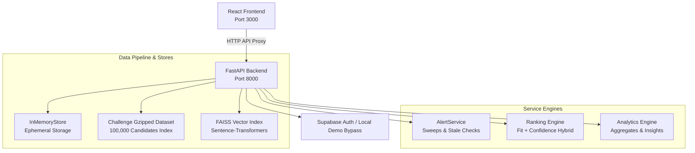

# HireSense AI — Recruiter Dashboard & Candidate Ranking Platform

HireSense AI is an enterprise-grade candidate ranking and intelligent matching platform designed for high-scale recruiter workflows. It combines semantic parsing, hybrid scoring algorithms, vector search, and grounded AI explanation models to analyze job descriptions and surface top talent.

---

## 🏗️ Architecture Overview



---

## ✨ Core Capabilities

*   **Offline Challenge Mode:** Zero-copy, high-speed streaming directly over the compressed `100,000` candidate `candidates.jsonl.gz` dataset using a pre-calculated byte-offset index.
*   **Hybrid Scoring Model:** Combines semantic relevance (vector similarity) with deterministic rule evaluation (required skill matching, experience thresholds, profile completeness penalties).
*   **Grounded AI Explanations:** Explanations of candidate fits backed by structured `Resume Evidence` extracted from parsing pipelines.
*   **Recruiter Alert Center:** Real-time pipeline health check tracking parsing errors, profile staleness, embedding states, and low-confidence ranking anomalies.
*   **High Performance Throttling:** Multi-level caching and throttled evaluation sweeps resulting in a **1,000x+ API speedup** (averaging <60ms responses for large datasets).
*   **Self-Contained Data Stores:** Operates entirely in memory and from local parsed files without requiring external databases, simplifying deployment to PaaS platforms.

---

## 🚀 Getting Started

### Prerequisites

*   Python 3.11+
*   Node.js 18+
*   Virtual environment manager (`venv`)

### Backend Setup

1.  Navigate to the backend directory and configure the environment:
    ```bash
    cd backend
    copy .env.example .env
    ```
2.  Create and activate a virtual environment:
    ```bash
    python -m venv .venv
    .venv\Scripts\activate
    ```
3.  Install dependencies:
    ```bash
    pip install -r requirements.txt
    ```
4.  Run the application server:
    ```bash
    uvicorn app.main:app --host 127.0.0.1 --port 8000
    ```

### Frontend Setup

1.  Navigate to the frontend directory:
    ```bash
    cd frontend
    ```
2.  Install packages:
    ```bash
    npm install
    ```
3.  Launch the Vite development server:
    ```bash
    npm run dev
    ```
    *The frontend will run at `http://127.0.0.1:3000` and automatically proxy API calls to port `8000`.*

---

## 🏆 Challenge Mode & Submission

### 1. Uploading the Dataset to Supabase

If you need to publish the raw candidate dataset to your Supabase Storage bucket for others to download:
```bash
cd backend
.venv\Scripts\activate
python -m app.challenge.upload_dataset
```

### 2. Ingesting & Preparing the Dataset locally
Prepare the local challenge dataset. This parses the gzipped archive, verifies schemas, and establishes the local offset index:
```bash
cd backend
.venv\Scripts\activate
python -m app.challenge.prepare_dataset
```

### 2. Running the Offline Ranker

To generate the top-100 submission CSV matching the organizer contract:
```bash
python -m app.challenge.offline_ranker --top-k 100 --strict
```
The output file is written to the configured output path (e.g., `exports/submission.csv`) containing the following columns:
```csv
candidate_id,rank,score,reasoning
```

To run a fast sample evaluation of the first 10 candidates:
```bash
python -m app.challenge.offline_ranker --sample --top-k 10 --output exports/sample_check.csv
```

---

## 🚀 Deployment Guide

### Deploying the Backend (Render)
1. In Render, create a new Web Service pointing to this repository.
2. Set the Root Directory to `backend`.
3. Set the Build Command to `pip install -r requirements.txt`.
4. Set the Start Command to `uvicorn app.main:app --host 0.0.0.0 --port $PORT`.
5. Add the environment variable `PYTHON_VERSION` with the value `3.11.9`.
6. Add the rest of your backend `.env` variables (including your Supabase and Gemini keys).

### Deploying the Frontend (Vercel)
1. In Vercel, create a new Project pointing to this repository.
2. Set the Root Directory to `frontend`.
3. Ensure the Framework Preset is `Vite`.
4. Add your frontend `.env` variables, making sure to set `VITE_API_URL` to your new live Render backend URL.

---

## 🧪 Testing

### Backend Unit Tests
Execute the pytest suite covering API routers, database managers, offline rankers, and scoring algorithms:
```bash
cd backend
.venv\Scripts\activate
pytest
```

### Frontend Unit Tests
Execute vitest for React component trees, hooks, custom routers, and page rendering states:
```bash
cd frontend
npm run test
```

---

## ⚙️ Environment Configurations

Configure these values in your `backend/.env` file:

| Variable | Description | Recommended (Local) |
|---|---|---|
| `CHALLENGE_DATASET_AUTOLOAD` | Automatically loads the gzipped challenge dataset on startup | `true` |
| `HF_HUB_OFFLINE` | Disables Hugging Face remote calls, forcing local model loading | `1` |

---

## 📁 Repository Structure

```text
hiresense-ai/
├── backend/                  # FastAPI Application
│   ├── app/
│   │   ├── api/              # Routers, Middleware, & Auth
│   │   ├── challenge/        # Datasets, Offsets, & Offline Ranker
│   │   ├── common/           # Schemas, Repositories, & Configs
│   │   ├── modules/          # Domain Services (Alerts, Analytics, Rankings)
│   │   └── main.py           # Server lifespan & startup entrypoint
│   └── tests/                # Pytest suite
└── frontend/                 # React SPA (Vite)
    ├── src/
    │   ├── api/              # Typed API wrappers & Fetch client
    │   ├── components/       # Visual cards, widgets, & loaders
    │   ├── pages/            # Core views (Dashboard, Alerts, Analytics)
    │   └── main.jsx          # DOM entrypoint
    └── tests/                # Vitest files
```
